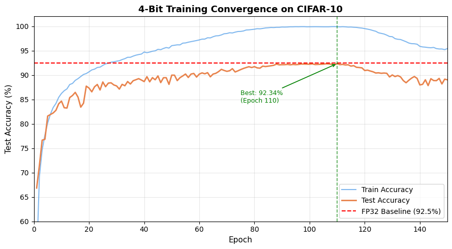
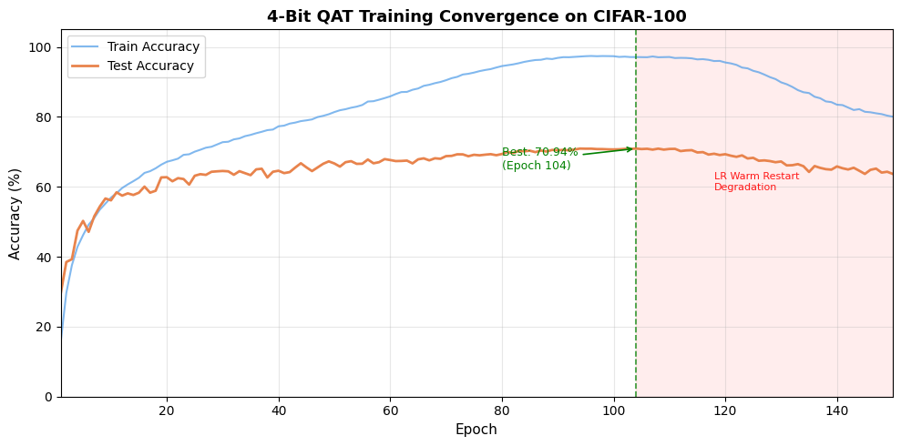
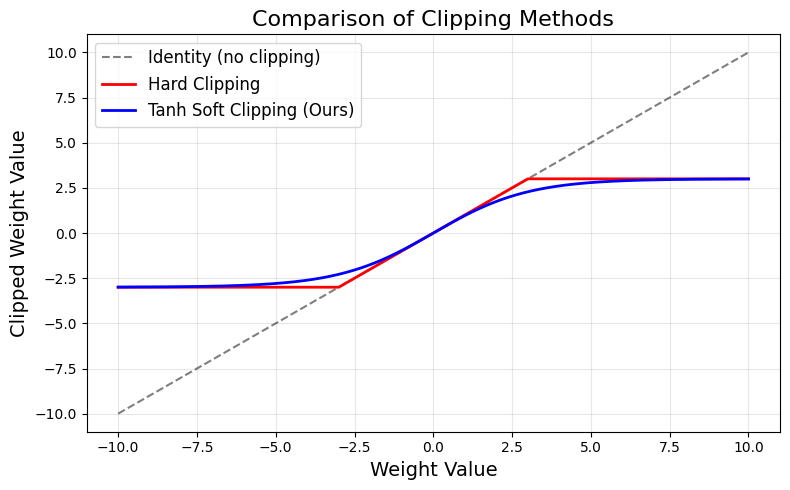

# VGG4bit and SimpleResNet4bit: True 4-Bit Quantized CNNs from Scratch

This project presents custom convolutional neural networks trained **from scratch** with **true 4-bit symmetric quantization** -- no pretrained weights, no GPU required.

- `VGG4bit`: A VGG-style deep CNN, ~3.25M parameters
- `SimpleResNet4bit`: A lightweight ResNet-inspired design with residual connections, ~73K parameters

---

## Results

### VGG4bit on CIFAR-10

| Metric | Value |
|---|---|
| Best Test Accuracy | **92.34%** (epoch 110) |
| FP32 Baseline (VGG) | 92.5% |
| Gap from FP32 | **0.16%** |
| FP32 Model Size | 12.40 MB |
| Int4 Model Size | **1.55 MB** |
| Compression | **8x** |
| Unique weight values at peak | 15/15 (full grid) |
| Hardware | Google Colab CPU (Intel Xeon) |
| Training cost | $0 |

### VGG4bit on CIFAR-100

| Metric | Value |
|---|---|
| Best Test Accuracy | **70.94%** (epoch 104) |
| Classes | 100 |
| FP32 Model Size | 12.58 MB |
| Int4 Model Size | **1.57 MB** |
| Compression | **8x** |
| Unique weight values at peak | 15/15 (full grid) |
| Hardware | Google Colab (GPU-assisted) |

### SimpleResNet4bit on CIFAR-10

| Metric | Value |
|---|---|
| Parameters | ~73K |
| Int4 Model Size | ~0.03 MB |
| Status | Training in progress |

---

## Key Achievements

- **92.34% on CIFAR-10** -- matches FP32 VGG baseline (92.5%) with only 0.16% gap
- **70.94% on CIFAR-100** -- same method, 100 classes, trained from random initialization
- **8x memory compression** over FP32 on both datasets
- **Full 4-bit grid utilization**: exactly 15/15 unique weight values maintained throughout training
- **No GPU required** for CIFAR-10 -- runs on free Google Colab CPU tier
- **Hardware agnostic**: same code runs on x86 (Colab) and ARM (OnePlus 9R mobile)

---

## Architecture Comparison

| Model | Params | CIFAR-10 Acc | CIFAR-100 Acc | FP32 Size | Int4 Size | Compression |
|---|---|---|---|---|---|---|
| `VGG4bit` (ours) | 3.25M | **92.34%** | **70.94%** | 12.40 MB | 1.55 MB | 8x |
| `SimpleResNet4bit` (ours) | 73K | in progress | - | ~0.28 MB | ~0.03 MB | 8x |
| DoReFa-Net (4-bit, GPU) | - | 85-88% | - | - | - | - |
| VGG-16 FP32 (baseline) | ~15M | 92.5% | - | ~59 MB | - | - |

---

## Method

Three components work together to enable stable 4-bit training from scratch:

1. **Symmetric 4-bit quantization** with STE (Straight-Through Estimator) -- forward pass uses quantized weights, backward pass uses full-precision gradients
2. **Trainable per-layer clipping** -- each layer learns its own optimal quantization range
3. **Tanh-based soft weight clipping** (key innovation) -- applied after each optimizer step:

```
W = 3.0 * tanh(W / 3.0)
```

This prevents gradient explosion while maintaining smooth gradient flow, unlike hard clipping which zeros gradients at boundaries.

---

## Training Details

- **Optimizer**: Custom QuantAwareAdamW (AdamW + gradient clipping + tanh soft clipping)
- **LR Schedule**: Cosine annealing with warm restarts over 150 epochs
- **Batch size**: 128
- **Data augmentation**: Random crop (32x32, padding=4), random horizontal flip

**Note on CIFAR-100**: The LR warm restart after epoch 104 caused accuracy to drop from 70.94% to 63.68% by epoch 150. The quantization itself remained stable (15/15 unique values held). This is a scheduler sensitivity issue, not a quantization failure. Using a non-restarting cosine schedule would preserve the 70.94% peak.

---

## Training Curves







---

## Installation

```bash
pip install -r requirements.txt
```

## Usage

```bash
python main.py
```

The script will prompt you to choose:
- `1` for SimpleResNet4bit (lightweight)
- `2` for VGG4bit (heavier, more accurate)

[](https://colab.research.google.com/drive/1F0HziLzVtOQWFG0efaepXdVisHfHBBJt?usp=sharing)

---

## Notes

- CIFAR-10 trained on CPU only. CIFAR-100 used GPU-assisted Colab run.
- Best performance at 90-120 epochs with cosine annealing.
- All quantization is true 4-bit (no fake quantization), training uses real STE gradients.
- Memory benchmarks computed on parameter-only compression.

---

## Research Paper

Full details in: `paper/True4bit_CPU_Quantization_ShivnathTathe_Draft.pdf`

---

## License

Copyright (c) 2025 Shivnath Tathe
All rights reserved.
This code is distributed for private academic and research purposes only.
Redistribution, reproduction, or commercial use is strictly prohibited without explicit written permission.

Contact: sptathe2001@gmail.com
